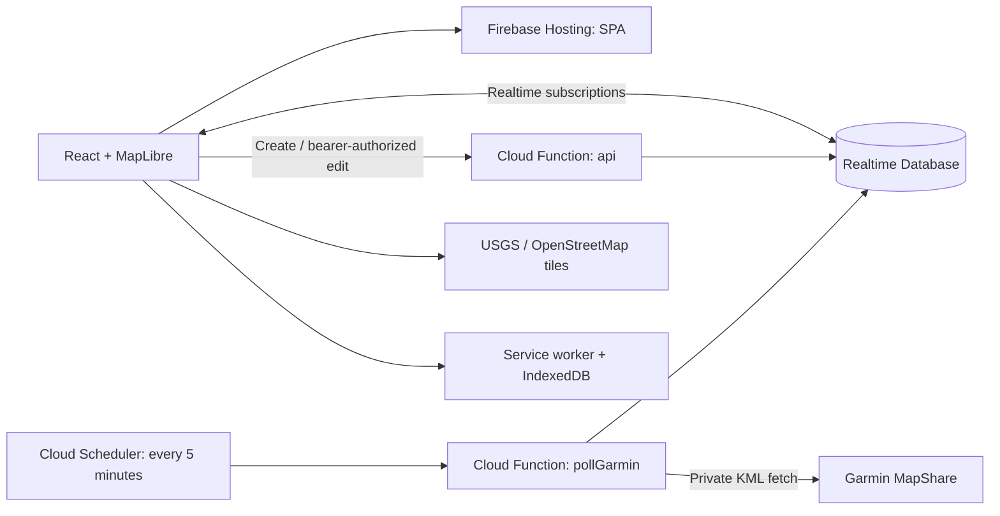

# Milemark

## Project overview

Milemark tracks self-directed running and hiking races for organizers and support crews. Upload a GPX route, add aid stations, and connect a Garmin MapShare/KML feed. Viewers get a live map, arrival estimates, interpolated splits, distance in miles, and ascent completed in feet.

- **Live app:** https://self-directed-tracker-type-two.web.app
- **Firebase project:** `self-directed-tracker-type-two`
- **Frontend:** React, Vite, and MapLibre GL
- **Basemap:** USGS Topo for U.S. routes, with OpenStreetMap for global coverage and failed USGS tiles. Neither requires an account or API key.
- **Backend:** Firebase Realtime Database and Node 22 Cloud Functions in `us-central1`
- **Access:** separate random UUID viewer and editor links, with no sign-in

## Run locally

Prerequisites: Node 22.13+ (Node 24 recommended for development), npm, and Java 21+ if using the Firebase database emulator.

```sh
npm ci
npm --prefix functions ci
npm run dev
```

Open `http://127.0.0.1:5174/demo` for simulated tracking. `/setup` opens the organizer form. Demo viewing does not require a Firebase account. Creating and editing real races requires a configured backend.

### Local backend with emulators

Use the emulator configuration below in the **gitignored** `public/firebase-config.json`. Preserve any existing production configuration separately before replacing it.

```json
{
  "apiKey": "demo-key",
  "projectId": "demo-paceline",
  "appId": "demo-app",
  "databaseURL": "https://demo-paceline.firebaseio.com",
  "apiBase": "http://127.0.0.1:5001/demo-paceline/us-central1/api",
  "emulator": true
}
```

Start the backend in a second terminal:

```sh
npm run build:functions
npx firebase emulators:start --only database,functions --project demo-paceline
```

Keep `npm run dev` running for the frontend. Cloud Scheduler does not run automatically in the emulators; `node tests/scheduler.mjs` exercises scheduled ingestion using mocked Garmin responses. The legacy `demo-paceline` name remains solely as the test namespace.

To test the production-built app and service worker locally:

```sh
npm run build:frontend
npm run start
```

Open `http://127.0.0.1:4173/demo`. Service workers are enabled in production builds, not the Vite development server.

## Deploy

Firebase Hosting serves the SPA, while Firebase owns the API, database, and five-minute ingestion schedule. A billing-enabled Firebase project, Realtime Database instance, and registered Firebase web app are required.

1. Configure `public/firebase-config.json` using `public/firebase-config.example.json` and the Firebase web app's public SDK identifiers. Use the exact database URL, keep `apiBase` as `/api`, and omit `emulator`. Never put service-account credentials in this file.
2. Authenticate with `npx firebase login`.
3. Validate, build, and deploy:

```sh
npm run typecheck
npm test
npm run build
npx firebase deploy --only database,functions,hosting --project self-directed-tracker-type-two
```

The predeploy check rejects missing, placeholder, or emulator frontend configuration. Functions are rebuilt by the deployment hook; the frontend must be built before deployment. Build output and local configuration are intentionally excluded from Git.

For frontend-only changes, run `npm run build:frontend`, then deploy with `--only hosting`. A custom domain is connected through Firebase Hosting and DNS; race data does not need migration.

Creation calls go directly to the `us-central1` API function URL so the Hosting CDN does not become a shared rate-limit bucket. Editor requests use `apiBase`. When using production Firebase from the local development server, set `apiBase` to `https://us-central1-self-directed-tracker-type-two.cloudfunctions.net/api`; `/api` rewrites are only available on Firebase Hosting.

## System architecture



| Path / component | Responsibility |
|---|---|
| `client.tsx` | Routes `/`, `/setup`, `/edit/:token`, `/r/:id`, `/demo` |
| `components/editor.tsx` | GPX upload, station placement, edits, feed diagnostics |
| `components/viewer.tsx` | Live race status, ETA, splits, offline status |
| `components/race-map.tsx` | MapLibre basemap, course, stations, location markers |
| `shared/race.ts` | Route projection, GPS validation, splits, pace and ETA |
| `functions/src/` | Private API and scheduled Garmin ingestion |
| `lib/firebase.ts` | Public SDK configuration and per-field live subscriptions |
| `lib/offline.ts`, `public/sw.js` | Offline race snapshots, app shell and viewed tiles |

Database records are divided into public `/races/{viewerUUID}` and private `/jobs/{viewerUUID}`, `/editKeys/{SHA256(editToken)}`, and `/limits/{ipHash}`. Clients can read only an exact valid race UUID; they cannot enumerate races, write records, or read private nodes. Static route fields and live fields have independent subscriptions, so heartbeat changes do not resend the route geometry.

See [System architecture](docs/ARCHITECTURE.md) for lifecycle, security boundaries, algorithms, and deployment details.

## How it works

1. **Set up:** upload a GPX, choose the start time, enter a Garmin MapShare or KML feed URL, and place aid stations by map click or route distance. Each visit to a repeated station can have its own route distance. The finish is added automatically.
2. **Share:** save the private edit link and give crews the independent viewer link. Before the start, viewers see the scheduled start time.
3. **Track:** the server polls Garmin every five minutes, validates GPS timestamps and plausible route progress, and writes a health heartbeat even when no new position arrives. With a ten-minute device interval, latency can approach fifteen minutes.
4. **Estimate:** distance and ascent use confirmed progress. ETAs use a stabilized 40-minute pace window when possible, otherwise overall pace. Recent-pace estimates add ten minutes per intermediate station; overall pace already includes stops and receives no extra allowance. A station is not treated as reached merely because the runner approaches it.
5. **Record:** crossings between confirmed fixes produce explicitly estimated splits. Suspicious jumps wait for corroboration; consistent switchback movement can use the previously accepted segment. Overdue ETAs retain their date/time and show minutes overdue.
6. **Finish:** automatic or manual completion stops polling and preserves the viewer URL as an archive. After 24 hours without a new fix since start/resume, polling pauses without claiming a finish; the organizer can resume or replace the feed.

### Offline and maps

A previously viewed race can reload offline from the cached app shell and IndexedDB snapshot. Viewed configured basemap tiles are cached on demand, capped at 300 tiles, with cache lifetime respected and stale tiles available offline. Unvisited areas may be blank offline, but the course and splits remain visible. No private API responses or feed URLs are cached. New service workers wait for old tabs to close before replacing their asset caches.

The basemap uses the public [USGS Topo service](https://basemap.nationalmap.gov/arcgis/rest/services/USGSTopo/MapServer), with visible USGS attribution. Tiles use ArcGIS order `/tile/{z}/{y}/{x}`. Native tiles stop at zoom 16 in the app and are enlarged at closer zoom levels. Outside the coarse U.S. coverage regions, or if a USGS tile request fails while online, the app selects OpenStreetMap with its own attribution. Course overlays initialize without waiting for tiles. Only viewport tiles are requested; there is no prefetch/download-area feature. See the [OpenStreetMap tile policy](https://operations.osmfoundation.org/policies/tiles/). No map API key is needed. `VITE_MAP_TILE_URL` and `VITE_MAP_ATTRIBUTION` can override the provider at build time; the build also adds that exact tile URL template to the service-worker cache allowlist. Unconfigured providers and private requests are never cached. Custom providers must permit this usage; `no-store` responses are not retained.

### Limits and privacy

- GPX uploads are limited to 10 MB and automatically simplified to at most 6,000 points. Elevation gaps are interpolated; at least two valid elevations are needed. Ascent is derived from the course profile, not measured barometric gain.
- The tracker targets running/hiking, with a 25 km/h reach limit and 250 m off-route rejection. GPS gaps, repeated geometry, and shortcuts can still yield uncertain results. The projected location is distinct from a GPS fix and limited to ten minutes.
- Route, start time, and stations lock after tracking starts. Name/feed changes remain available. Feed replacement resumes paused tracking. The editor displays feed health and offers a throttled server-side test that includes at least the preceding 24 hours.
- Links are bearer credentials, with no account recovery or link rotation. Feed URLs never reach viewers, but Garmin MapShare may separately be discoverable by its share name. One device per unprotected feed is supported; redirects and unapproved hosts are rejected.
- Creation is limited to ten requests per observed client/proxy IP per hour. The rightmost Cloud Run-observed forwarded hop selects the bucket. Old quota records expire. This is abuse friction, not authentication.
- CSP permits Firebase long polling when WebSockets are unavailable. Referrers expose only the origin; Hosting also sends HSTS. There are no analytics.

## Verification

```sh
npm run typecheck
npm test
# With the database/functions emulators running:
npm run test:rules
npm run test:integration
npm run test:scheduler
```

Browser checks use Chrome at `/Applications/Google Chrome.app/Contents/MacOS/Google Chrome` (adjust for another platform). After building and starting the preview, `node tests/review-browser.mjs` verifies offline/reconnection, payload size, stable markers, and large GPX uploads. `node tests/units-browser.mjs` checks imperial units and elevation; `node tests/service-worker.mjs` checks installation behavior.

`tests/production.mjs` creates temporary production records and removes them in a `finally` block using the authenticated Firebase CLI. It tests live updates, mobile layout, archive reload, and Firebase long polling with WebSockets disabled. If cleanup fails, it reports a recovery file. Run only against this project's deployment:

```sh
RACE_TEST_ORIGIN=https://self-directed-tracker-type-two.web.app node tests/production.mjs
```

Real Garmin connectivity has also been verified from the deployed function: healthy empty results and 145 historical timestamped points using an ISO `d1` filter. Live movement and course-specific split matching still require an active device and matching GPX. Automated scheduler tests mock Garmin.

## Replay a recording

Open `/replay` (also linked from the home page) and upload a GPX course plus a timestamped Garmin KML recording. Use **Play/Pause**, **Restart**, the **time T scrubber**, and speeds from 1× to 600×. Add optional aid stations by mileage or click the route to choose their distance; the finish is included automatically. Progress is displayed in miles and elevation gain in feet.

Replay uses the same KML parser, position acceptance rules, split interpolation, and ETA calculations as live races. Seeking backward rebuilds results so future splits and completion do not leak into earlier times. The race start defaults to the first recorded position; set an earlier start when the recording begins partway into the race. The simulated clock also supports future-dated recordings. KML validation and parsing run in a web worker with a loading indicator; replacement uploads cancel previous parsing. Slider input is debounced for 150 ms, with immediate application on release.

Files remain in browser memory: replay creates no Firebase records, contacts no Garmin feed, and reload clears the session. Basemap tiles still load over the network. GPX files are limited to 10 MB; KML files to 25 MB and 100,000 timestamped positions (kept without downsampling). Untimed KML paths cannot be replayed. The replay shows positions accepted by the live filters, so off-route or implausible points may be rejected.

## Out-and-back trips and early returns

Before tracking starts, enable **Out-and-back · detect early turnaround** in setup/edit. Upload the **full round-trip GPX**, retracing the same trail with the planned turnaround at half the route distance. This mode checks that the outbound and return halves align within 200 meters, allowing minor trail deviations and GPS drift; it is not for loops or a different descent route. It can also be enabled in `/replay` after uploading a matching course.

The tracker matches GPS to the outbound half and follows direction explicitly. An early return requires at least three retreating updates spanning 10 minutes, a retreat of at least 500 meters from the furthest point, and no new outbound peak during that window. A short reversal, duplicate timestamps, or off-route updates do not confirm a turnaround. Sparse transmissions delay detection; polling Garmin more often does not create new positions.

After confirmation, viewers see **Returning early**, the inferred turnaround, a shortened mileage/elevation target, and a revised finish ETA. Completed splits stay intact; stations in the bypassed section are marked **Skipped · early return**. The original GPX remains visible. Displayed distance represents current route progress and may decrease during return backtracking; the viewer explains this and keeps ETA tied to current location. The first ETA is provisional and uses overall pace; subsequent return samples supply return pace. The inferred turnaround is the furthest accepted position, so sparse GPS can underestimate the actual turnaround distance. Completion at the start archives the trip and stops Garmin polling as usual.

On the private edit page, **We’ve turned around** confirms a return from the furthest accepted location. **Resume original route** undoes return mode, removes inferred return splits, and restores the original targets. Automatic early detection rearms after 150 meters of renewed outbound movement. These controls require an active trip with an accepted GPS position. Changing route mode is locked once tracking starts. Use replay to check your route and recording before the trip; this is a viewer estimate, not a weather or navigation decision system.

Validation: `npm test` covers early/planned turns, brief reversal, off-route fixes, skipped splits, return pace, elevation, manual correction, and backward replay. `node tests/outback-browser.mjs` (with the local Firebase emulators running) checks replay and private editor controls updating a live viewer.

Browser checks are available through `npm run test:replay`, `npm run test:outback`, and `npm run test:maps`, or `npm run test:browser` for all three. Build first and run the preview on port 4173; the out-and-back integration test also requires Firebase emulators on ports 5001 and 9000 (`demo-paceline`). These scripts use the installed Chrome browser on macOS.
