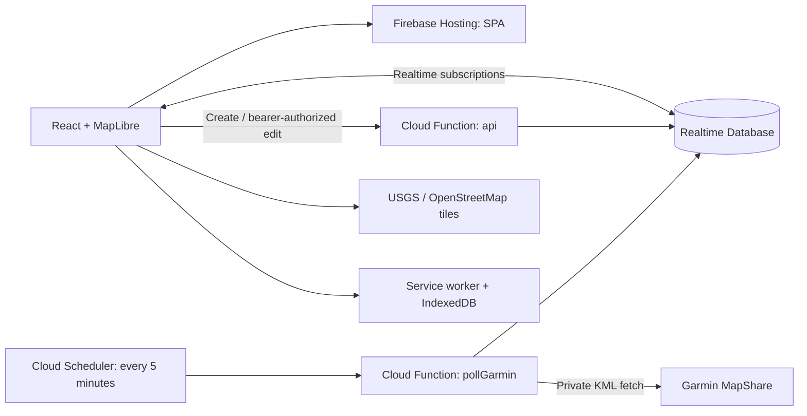

# Milemark

## Project overview

Milemark tracks self-directed running and hiking races for organizers and support crews. Upload a GPX route, add aid stations, and connect a Garmin MapShare/KML feed. Viewers get a live map, arrival estimates, interpolated splits, distance in miles, and ascent completed in feet.

- **Live app:** https://self-directed-tracker-type-two.web.app
- **Firebase project:** `self-directed-tracker-type-two`
- **Frontend:** React, Vite, and MapLibre GL
- **Basemap:** USGS Topo for U.S. routes, with OpenStreetMap for global coverage and failed USGS tiles. Neither requires an account or API key.
- **Backend:** Firebase Realtime Database and Node 22 Cloud Functions in `us-central1`
- **Access:** separate random UUID viewer and editor links, with no sign-in

## Run locally

Prerequisites: Node 22.13+ (Node 24 recommended for development), npm, and Java 21+ if using the Firebase database emulator.

```sh
npm ci
npm --prefix functions ci
npm run dev
```

Open `http://127.0.0.1:5174/demo` for simulated tracking. `/setup` opens the organizer form. Demo viewing does not require a Firebase account. Creating and editing real races requires a configured backend.

### Local backend with emulators

Use the emulator configuration below in the **gitignored** `public/firebase-config.json`. Preserve any existing production configuration separately before replacing it.

```json
{
  "apiKey": "demo-key",
  "projectId": "demo-paceline",
  "appId": "demo-app",
  "databaseURL": "https://demo-paceline.firebaseio.com",
  "apiBase": "http://127.0.0.1:5001/demo-paceline/us-central1/api",
  "emulator": true
}
```

Start the backend in a second terminal:

```sh
npm run build:functions
npx firebase emulators:start --only database,functions --project demo-paceline
```

Keep `npm run dev` running for the frontend. Cloud Scheduler does not run automatically in the emulators; `node tests/scheduler.mjs` exercises scheduled ingestion using mocked Garmin responses. The legacy `demo-paceline` name remains solely as the test namespace.

To test the production-built app and service worker locally:

```sh
npm run build:frontend
npm run start
```

Open `http://127.0.0.1:4173/demo`. Service workers are enabled in production builds, not the Vite development server.

## Deploy

Firebase Hosting serves the SPA, while Firebase owns the API, database, and five-minute ingestion schedule. A billing-enabled Firebase project, Realtime Database instance, and registered Firebase web app are required.

1. Configure `public/firebase-config.json` using `public/firebase-config.example.json` and the Firebase web app's public SDK identifiers. Use the exact database URL, keep `apiBase` as `/api`, and omit `emulator`. Never put service-account credentials in this file.
2. Authenticate with `npx firebase login`.
3. Validate, build, and deploy:

```sh
npm run typecheck
npm test
npm run build
npx firebase deploy --only database,functions,hosting --project self-directed-tracker-type-two
```

The predeploy check rejects missing, placeholder, or emulator frontend configuration. Functions are rebuilt by the deployment hook; the frontend must be built before deployment. Build output and local configuration are intentionally excluded from Git.

For frontend-only changes, run `npm run build:frontend`, then deploy with `--only hosting`. A custom domain is connected through Firebase Hosting and DNS; race data does not need migration.

Creation calls go directly to the `us-central1` API function URL so the Hosting CDN does not become a shared rate-limit bucket. Editor requests use `apiBase`. When using production Firebase from the local development server, set `apiBase` to `https://us-central1-self-directed-tracker-type-two.cloudfunctions.net/api`; `/api` rewrites are only available on Firebase Hosting.

## System architecture



| Path / component | Responsibility |
|---|---|
| `client.tsx` | Routes `/`, `/setup`, `/edit/:token`, `/r/:id`, `/demo` |
| `components/editor.tsx` | GPX upload, station placement, edits, feed diagnostics |
| `components/viewer.tsx` | Live race status, ETA, splits, offline status |
| `components/race-map.tsx` | MapLibre basemap, course, stations, location markers |
| `shared/race.ts` | Route projection, GPS validation, splits, pace and ETA |
| `functions/src/` | Private API and scheduled Garmin ingestion |
| `lib/firebase.ts` | Public SDK configuration and per-field live subscriptions |
| `lib/offline.ts`, `public/sw.js` | Offline race snapshots, app shell and viewed tiles |

Database records are divided into public `/races/{viewerUUID}` and private `/jobs/{viewerUUID}`, `/editKeys/{SHA256(editToken)}`, and `/limits/{ipHash}`. Clients can read only an exact valid race UUID; they cannot enumerate races, write records, or read private nodes. Static route fields and live fields have independent subscriptions, so heartbeat changes do not resend the route geometry.

See [System architecture](docs/ARCHITECTURE.md) for lifecycle, security boundaries, algorithms, and deployment details.

## How it works

1. **Set up:** upload a GPX, choose the start time, enter a Garmin MapShare or KML feed URL, and place aid stations by map click or route distance. Each visit to a repeated station can have its own route distance. The finish is added automatically.
2. **Share:** save the private edit link and give crews the independent viewer link. Before the start, viewers see the scheduled start time.
3. **Track:** the server wakes every minute, requests Garmin near expected deliveries, validates GPS timestamps and plausible route progress, and writes a heartbeat even without a Garmin request. Satellite delivery adds variable latency.
4. **Estimate:** distance and ascent use confirmed progress. ETAs use a stabilized 40-minute pace window when possible, otherwise overall pace. Recent-pace estimates add ten minutes per intermediate station; overall pace already includes stops and receives no extra allowance. A station is not treated as reached merely because the runner approaches it.
5. **Record:** crossings between confirmed fixes produce explicitly estimated splits. Suspicious jumps wait for corroboration; consistent switchback movement can use the previously accepted segment. Estimated arrivals that pass without a confirming GPS update show “Likely at · awaiting GPS.”
6. **Finish:** automatic or manual completion stops polling and preserves the viewer URL as an archive. After 24 hours without a new fix since start/resume, polling pauses without claiming a finish; the organizer can resume or replace the feed.

### Offline and maps

A previously viewed race can reload offline from the cached app shell and IndexedDB snapshot. Viewed configured basemap tiles are cached on demand, capped at 300 tiles, with cache lifetime respected and stale tiles available offline. Unvisited areas may be blank offline, but the course and splits remain visible. No private API responses or feed URLs are cached. New service workers wait for old tabs to close before replacing their asset caches.

The basemap uses the public [USGS Topo service](https://basemap.nationalmap.gov/arcgis/rest/services/USGSTopo/MapServer), with visible USGS attribution. Tiles use ArcGIS order `/tile/{z}/{y}/{x}`. Native tiles stop at zoom 16 in the app and are enlarged at closer zoom levels. Outside the coarse U.S. coverage regions, or if a USGS tile request fails while online, the app selects OpenStreetMap with its own attribution. Course overlays initialize without waiting for tiles. Only viewport tiles are requested; there is no prefetch/download-area feature. See the [OpenStreetMap tile policy](https://operations.osmfoundation.org/policies/tiles/). No map API key is needed. `VITE_MAP_TILE_URL` and `VITE_MAP_ATTRIBUTION` can override the provider at build time; the build also adds that exact tile URL template to the service-worker cache allowlist. Unconfigured providers and private requests are never cached. Custom providers must permit this usage; `no-store` responses are not retained.

### Limits and privacy

- GPX uploads are limited to 10 MB and automatically simplified to at most 6,000 points. Elevation gaps are interpolated; at least two valid elevations are needed. Ascent is derived from the course profile, not measured barometric gain.
- The tracker targets running/hiking, with a 25 km/h reach limit and 250 m off-route rejection. GPS gaps, repeated geometry, and shortcuts can still yield uncertain results. The projected location is distinct from a GPS fix and limited to ten minutes.
- Route, start time, and stations lock after tracking starts. Name/feed changes remain available. Feed replacement resumes paused tracking. The editor displays feed health and offers a throttled server-side test that includes at least the preceding 24 hours.
- Links are bearer credentials, with no account recovery or link rotation. Feed URLs never reach viewers, but Garmin MapShare may separately be discoverable by its share name. One device per unprotected feed is supported; redirects and unapproved hosts are rejected.
- Creation is limited to ten requests per observed client/proxy IP per hour. The rightmost Cloud Run-observed forwarded hop selects the bucket. Old quota records expire. This is abuse friction, not authentication.
- CSP permits Firebase long polling when WebSockets are unavailable. Referrers expose only the origin; Hosting also sends HSTS. There are no analytics.

## Verification

```sh
npm run typecheck
npm test
# With the database/functions emulators running:
npm run test:rules
npm run test:integration
npm run test:scheduler
```

Browser checks use Chrome at `/Applications/Google Chrome.app/Contents/MacOS/Google Chrome` (adjust for another platform). After building and starting the preview, `node tests/review-browser.mjs` verifies offline/reconnection, payload size, stable markers, and large GPX uploads. `node tests/units-browser.mjs` checks imperial units and elevation; `node tests/service-worker.mjs` checks installation behavior.

`tests/production.mjs` creates temporary production records and removes them in a `finally` block using the authenticated Firebase CLI. It tests live updates, mobile layout, archive reload, and Firebase long polling with WebSockets disabled. If cleanup fails, it reports a recovery file. Run only against this project's deployment:

```sh
RACE_TEST_ORIGIN=https://self-directed-tracker-type-two.web.app node tests/production.mjs
```

Real Garmin connectivity has also been verified from the deployed function: healthy empty results and 145 historical timestamped points using an ISO `d1` filter. Live movement and course-specific split matching still require an active device and matching GPX. Automated scheduler tests mock Garmin.

## Replay a recording

Open `/replay` (also linked from the home page) and upload a GPX course plus a timestamped Garmin KML recording. Use **Play/Pause**, **Restart**, the **time T scrubber**, and speeds from 1× to 600×. Add optional aid stations by mileage or click the route to choose their distance; the finish is included automatically. Progress is displayed in miles and elevation gain in feet.

Replay uses the same KML parser, position acceptance rules, split interpolation, and ETA calculations as live races. Seeking backward rebuilds results so future splits and completion do not leak into earlier times. The race start defaults to the first recorded position; the entered start controls the acceptance window, while elapsed time starts with accepted tracker data. The simulated clock also supports future-dated recordings. KML validation and parsing run in a web worker with a loading indicator; replacement uploads cancel previous parsing. Slider input is debounced for 150 ms, with immediate application on release.

Files remain in browser memory: replay creates no Firebase records, contacts no Garmin feed, and reload clears the session. Basemap tiles still load over the network. GPX files are limited to 10 MB; KML files to 25 MB and 100,000 timestamped positions (kept without downsampling). Untimed KML paths cannot be replayed. The replay shows positions accepted by the live filters, so off-route or implausible points may be rejected.

## Out-and-back trips and early returns

Before tracking starts, enable **Out-and-back · detect early turnaround** in setup/edit. Upload the **full round-trip GPX**, retracing the same trail with the planned turnaround at half the route distance. This mode checks that the outbound and return halves align within 200 meters, allowing minor trail deviations and GPS drift; it is not for loops or a different descent route. It can also be enabled in `/replay` after uploading a matching course.

The tracker matches GPS to the outbound half and follows direction explicitly. An early return requires at least three retreating updates spanning 10 minutes, a retreat of at least 500 meters from the furthest point, and no new outbound peak during that window. A short reversal, duplicate timestamps, or off-route updates do not confirm a turnaround. Sparse transmissions delay detection; polling Garmin more often does not create new positions.

After confirmation, viewers see **Returning early**, the inferred turnaround, a shortened mileage/elevation target, and a revised finish ETA. Completed splits stay intact; stations in the bypassed section are marked **Skipped · early return**. The original GPX remains visible. Displayed distance represents current route progress and may decrease during return backtracking; the viewer explains this and keeps ETA tied to current location. The first ETA is provisional and uses overall pace; subsequent return samples supply return pace. The inferred turnaround is the furthest accepted position, so sparse GPS can underestimate the actual turnaround distance. Completion at the start archives the trip and stops Garmin polling as usual.

On the private edit page, **We’ve turned around** confirms a return from the furthest accepted location. **Resume original route** undoes return mode, removes inferred return splits, and restores the original targets. Automatic early detection rearms after 150 meters of renewed outbound movement. These controls require an active trip with an accepted GPS position. Changing route mode is locked once tracking starts. Use replay to check your route and recording before the trip; this is a viewer estimate, not a weather or navigation decision system.

Validation: `npm test` covers early/planned turns, brief reversal, off-route fixes, skipped splits, return pace, elevation, manual correction, and backward replay. `node tests/outback-browser.mjs` (with the local Firebase emulators running) checks replay and private editor controls updating a live viewer.

Browser checks are available through `npm run test:replay`, `npm run test:outback`, and `npm run test:maps`, or `npm run test:browser` for all three. Build first and run the preview on port 4173; the out-and-back integration test also requires Firebase emulators on ports 5001 and 9000 (`demo-paceline`). These scripts use the installed Chrome browser on macOS.

Out-and-back aid stations now include automatic return visits with independent ETAs and crossing splits. Return distance is the full planned distance minus the outbound station distance. A station within 150 meters (about 0.09 mi) of the route midpoint is treated as a single summit/turnaround visit. An explicitly entered return station within 100 meters of the mirrored distance is retained instead of creating a duplicate. Generated visits follow edits to the outbound station and are also available for existing races; they do not create extra overlapping map markers. Early returns skip bypassed visits while retaining visits on the way back.

**Starting early:** Polling opens one hour early. Positions within 50 meters of the start are kept as timing anchors without starting the race clock. An accepted departure, before or after the scheduled time, starts the clock at the last such position (or the departure timestamp if none exists). This is approximate with sparse GPS and subject to GPS drift. Late warm-up positions use the same 50-meter departure guard. Existing started races are not automatically retimed.

Use `nvm use` to select the Node version in `.nvmrc` before installing or building. Local scratch courses under `public/courses/` are explicitly excluded from Firebase Hosting; the untracked Longs conversion script is not part of the supported application tooling.


## Delivery timing and terrain ETAs

The scheduler wakes every minute and writes a heartbeat independently of Garmin requests. Polls are deferred until one minute before the expected delivery, based on recent GPS timestamp gaps and observed delivery gaps (so batched five-minute logs need not imply five-minute transmissions). Missing expected messages retry each minute, easing to five minutes after 15 minutes; failures retry after one minute. No-fix feeds retry every five minutes. Completed jobs remain disabled. `lastLocationReceivedAt` is receipt time, distinct from `lastFeedPointAt` (device timestamp). Expectations are estimates, not promises. Legacy records without receipt metadata explicitly show the GPS timestamp instead.

Feed failures show a red banner. Sanitized failure reasons and the last failed request time are retained in the private job and logged without the private feed URL; successful recovery clears the public banner. Historical failures before this change were swallowed and cannot reliably be diagnosed retrospectively.

Every remaining station gets its own ETA. With GPX elevation, recent observed effort is calibrated against grade-weighted route distance and applied across the remaining profile. The running energy-cost curve comes from [Minetti et al. (2002)](https://doi.org/10.1152/japplphysiol.01177.2001), with a conservative downhill floor, bounded grade and at least 50m grade smoothing. It cannot infer technical footing, surface conditions or weather from GPX elevations. Missing elevation falls back to ordinary pace. Elapsed wall time alone never labels a station overdue; an estimated arrival in the past is “Likely at · awaiting GPS.”

A reversal close to an out-and-back midpoint may infer visiting the tip: within 75m, or within both 500m and 10% of outbound distance when recent pace and the gap make the full visit plausible. The estimated turn timestamp lies between observed points; stations within 150m of the midpoint share the inferred visit. Substantial early returns retain the existing corroboration rules. Raw GPS coordinates remain unchanged.


## Estimated completion and replay demo

A healthy Garmin poll can mark an estimated finish after the anchored finish ETA plus at least 20 minutes (or twice the learned transmission interval, whichever is longer). Eligibility requires at least 90% progress, no more than 1 km remaining along the route and geographically, and the last two fixes moving toward the finish. Out-and-backs must be returning. A newer unaccepted feed position, feed failure, paused tracking, or stale poll blocks inference. The inferred finish uses the predicted timestamp, clearly labels it as estimated, preserves the last real GPS position, and stops polling. This can still misclassify a stop near the finish; it is not a confirmed GPS result.

`/replay` has **Use demo data**, using the Highline recording and its configured aids. Its 11 original points are preserved. An extra hour of playback simulates a healthy feed with no new positions to demonstrate estimated completion. Seeking backward removes the inferred finish. The historical race's organizer-reported finish is separate from this demo inference.

Skipped Garmin polls read only the status and next-poll timestamp and write the heartbeat child, avoiding full race-node transfers. Terrain ETA dwell allowances follow the terrain calibration source; recent calibrated effort speed is floored at half the whole-race effort speed. Estimated completion has a distinct badge and prominent unconfirmed-finish notice.

### Compact race storage

Live state, immutable course versions, and the last 500 breadcrumbs now live in separate nodes (`races`, `courses`, `tracks`). Distances are derived in memory. GPS coordinates use six decimal places, distance fields three decimal kilometers, and elevations to tenths of a meter. Stable timestamp keys make breadcrumb updates append-only with separate trimming. See [storage layout](docs/ARCHITECTURE.md#storage-layout-september-2026) for caching and crash recovery. Already-open tabs from before this schema update need a normal refresh.

For existing data, `node scripts/migrate-race-storage.mjs` previews the migration and saves a local backup under `work/`. After deploying the compatible viewer, rules, and functions, run with `MILEMARK_MIGRATE=1` to apply conditional per-race updates. It refuses a moving live race; it does not silently overwrite concurrent changes. Firebase CLI authentication and built functions are required.

### Crew navigation and event replay

On `/replay`, enter an event slug, UUID or viewer URL and choose **Load event** to replay its saved course, aid stations, and retained GPS positions (up to 500). This never retrieves the private Garmin URL or modifies the race. Playback recalculates tracking with current rules; it is not a reconstruction of historical server decisions or organizer overrides.

The viewer shows the next aid ETA above the stats and links to Google Maps driving directions for each station. Coordinates mark the station, not a verified parking area; crews must check vehicle access.

The scheduled time controls the countdown and polling window. Elapsed time and pace start at the first accepted tracker timestamp, including late starts. Warm-up fixes near the start, whether early or late, wait for departure, using the last start-line fix as the anchor. Tracker timestamps approximate departure; they are not an official chip time.

Event replay contains only GPS fixes accepted live; use raw KML uploads to investigate rejected fixes. Completed viewers link to replay with the event prefilled. Overall pace and terrain calibration exclude route distance before a mid-course tracker start. Personal scratch recordings, local courses, and the one-off Longs converter are ignored and are not shipped as project assets.

### On-demand SMS (Twilio; optional)

SMS is implemented but requires a phone number and credentials before activation. It sends replies only to incoming requests; no scheduled alerts or unsolicited messages. Text a viewer URL or UUID, then `UPDATE`, `STATUS`, or `?` for the last selected event. This remembers requests received by our number, not the user's phone message history. Invalid race IDs do not replace the previous selection. Context expires for reuse after 30 days. Sender/receiver pairs are keyed by HMAC; raw phone numbers and SMS bodies are not stored by Milemark (Twilio has its own message logs). Context nodes are private under the default database rules. Replies use the timezone at the GPX starting location (including daylight saving), GPS timestamps, next aid ETA, and clear estimated-finish wording. Replies can span multiple billable SMS segments.

To activate:

1. Choose an SMS-capable Twilio number and complete the registration/verification Twilio requires for its destination countries.
2. Store the **account Auth Token** securely, using the CLI prompt (not chat or a committed file): `firebase functions:secrets:set TWILIO_AUTH_TOKEN --project self-directed-tracker-type-two`. An API key is not a substitute for the webhook-signing Auth Token.
3. In ignored `functions/.env.self-directed-tracker-type-two`, set `TWILIO_PHONE_NUMBER=+...` and `TWILIO_WEBHOOK_URL=https://us-central1-self-directed-tracker-type-two.cloudfunctions.net/sms`. The URL must exactly match the webhook configured in Twilio, including any query string.
4. Set `VITE_SMS_NUMBER=+...` in the ignored frontend production build environment. Without a valid number the SMS buttons remain hidden. Build, then deploy `functions:sms,hosting`.
5. Configure Twilio's incoming-message webhook to HTTP **POST** to that URL. Configure Twilio opt-out handling; STOP clears Milemark's remembered race and emits no additional reply. Advanced Opt-Out START/HELP responses are left to Twilio.
6. Send a real UUID from a phone, then UPDATE; verify another valid UUID switches races and STOP opts out. Physical iOS/Android compose links and live Twilio delivery need verification during activation.

The webhook validates every Twilio signature using the official SDK and configured URL, verifies the receiving number, deduplicates recent MessageSids, and caps replies at 12 per sender per hour. Retried messages that were already claimed return empty TwiML; this prevents duplicate replies, but after a process interruption the sender may need to text UPDATE again. No REST sending API credential or private Garmin feed URL is needed. Do not deploy `functions:sms` until the secret and number are configured; unrelated deployments can target `functions:api,functions:pollGarmin,hosting` explicitly.

### Public race slugs

Organizers can optionally set a 3–40 character slug in the editor, using lowercase letters, numbers and single hyphens, starting with a letter (for example `highline-2026`). Reserved SMS commands cannot be slugs. Saving uses a Realtime Database transaction to claim the name exclusively before assigning it. Existing UUID viewer links always work. Viewer sharing, replay and SMS accept either form; new share/SMS links prefer the slug. Slugs make race pages easier to discover by guessing, and never expose the organizer's separate UUID edit link or Garmin feed.

A slug claim remains attached to its race permanently, including after renaming or an interrupted save, so links are never reassigned to somebody else's race. An organizer can retry a claimed name on the same race. The `slugs` index supports exact-name reads only, denies enumeration and client writes, and maps to the canonical race UUID. Offline viewer snapshots retain the alias used to open the race.

Slugs are limited to **five permanent names per race**, enforced atomically with a private `slugClaims/{raceId}` ledger. Existing aliases are counted on first use after this change; an older race already at or above the cap can reuse its names but cannot add more. Names consumed by an interrupted assignment count toward the cap; a name found to belong to another race does not. `YES`, `UNSTOP` and `INFO` are reserved along with other messaging keywords. The editor checks exact-name availability after 350 ms of idle typing; only the save transaction guarantees the claim. Offline alias URLs use the canonical ID in their saved snapshot and do not require another alias lookup.

### Estimated ascent

Ascent uses a distance-weighted 100-meter moving average of the piecewise-linear GPX profile, sampled every 25 meters. Reversals smaller than 3 meters are ignored before accumulating uphill gain. The smoothing window narrows at route endpoints; long climbs are retained while small elevation jitter is suppressed. Results are cached and interpolated at confirmed route progress, including the actual portions traversed on an early out-and-back return. The estimate can omit short real undulations and cannot reproduce a watch's barometric ascent exactly. Missing profiles remain unavailable. New course versions retain 0.1-meter elevation precision to reduce rounding artifacts. This ascent filter does not change the separate terrain ETA calibration.

### Crew-reported aid departure

Any viewer with the public race link can choose **Runner has left this aid** while GPS-based dwell detection places the runner at an aid station and fewer than ten minutes have passed since its recorded arrival. The server validates the station and GPS timestamp inside a transaction, records the server's departure time, and increments the race revision. Only one report can be active per GPS fix. The report removes the remaining stop allowance and anchors onward ETAs to the reported departure for all viewers and SMS, without altering positions or splits. A banner identifies the provisional crew report. Any newer accepted GPS fix supersedes it: if the runner is still at the aid, normal dwell behavior resumes using the original arrival time. Offline viewers can see cached reports but must reconnect to submit one.

GPX `<wpt>` waypoints are imported as editable aid stations in setup and replay, using their names and their first nearest position along the route. Start/finish waypoints are omitted because those rows already exist; duplicate name/location pairs are collapsed. Review imported distances on loops and out-and-backs. A maximum of 50 aid stations is supported. Web viewer, map, replay, and SMS timestamps use the timezone resolved from the course start coordinates, including for existing events. The setup date input still explicitly uses the organizer’s browser timezone.

Crew navigation includes copyable latitude/longitude coordinates for the next aid and every aid row, computed from the saved route without a network request. Offline crews can paste these into a maps app with downloaded maps; web directions links may still require internet. If clipboard access is denied, the coordinate field is selected for manual copying. Coordinates identify the trail aid location, not necessarily road access or parking.

Rolling distance pace and terrain calibration subtract GPS-confirmed aid dwell: consecutive fixes at most 20 minutes apart, within 100 m of the same aid along the course and geographically, moving at most 50 m. Unknown arrival/departure portions remain elapsed time; stops away from aid stations are not removed. Overall fallback pace still includes all elapsed time and adds no extra aid allowance.

The latest timestamp-valid GPS position is stored separately from accepted course progress. Off-route locations (over 250 m from the remaining course, including returning behind confirmed progress on a one-way course) remain visible, show an Off route notice, and pause ETA/projection until rejoining. They do not fabricate splits, finish, or completed distance. The live location is cached offline; retained replay breadcrumbs still contain accepted course fixes only.
