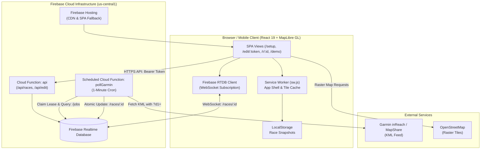
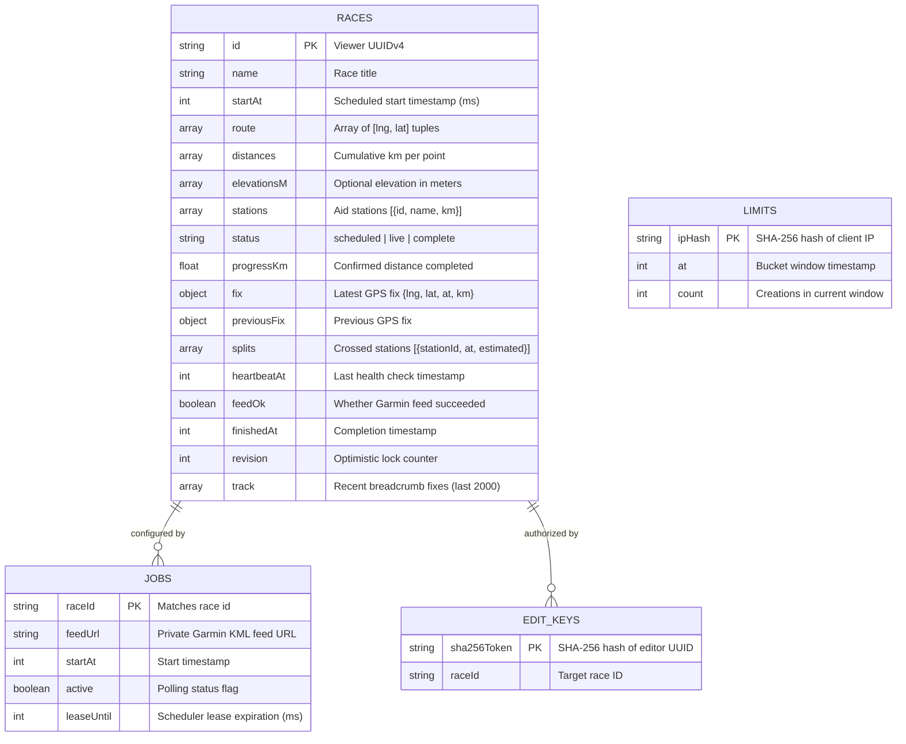
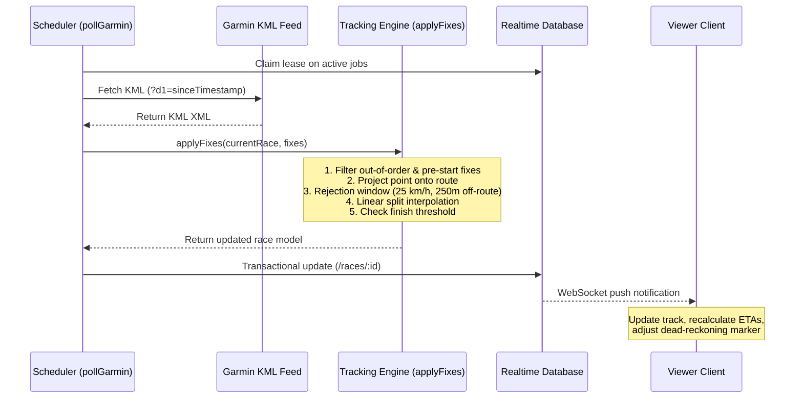
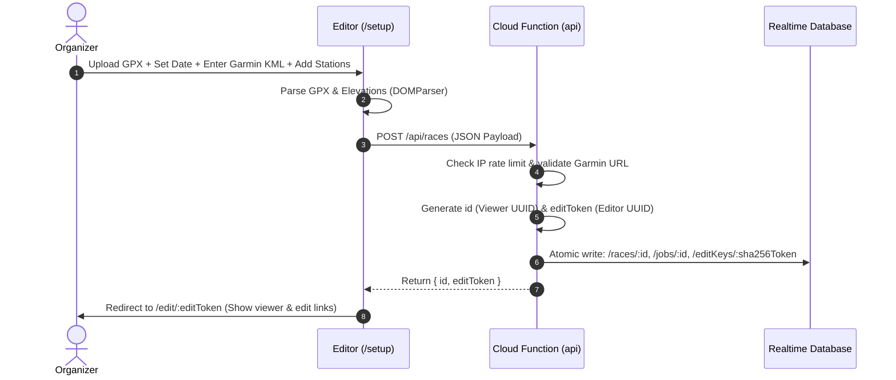
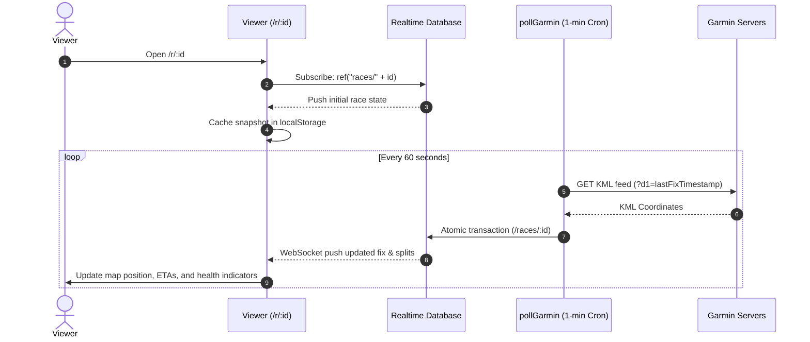

# Milemark System Architecture

Milemark is a self-directed race tracking platform designed for desktop and mobile support crews. It provides live GPS tracking, course progression, aid station ETAs, and interpolated split times using Garmin inReach satellite feeds and OpenStreetMap raster tiles rendered via MapLibre GL.

---

## 1. High-Level System Architecture

---

## 2. Core Subsystems

### 2.1 Frontend Client (`client.tsx`, `components/`)

* **Framework**: React 19 SPA bundled with Vite (`vite.firebase.config.ts`), deployed to `dist/client`.
* **Routing**: Lightweight pathname matching in [`client.tsx`](file:///Users/daniel/self-directed-race-tracker/client.tsx) without heavy client routing dependencies:
  * `/`: Home landing page ([`components/race-app.tsx`](file:///Users/daniel/self-directed-race-tracker/components/race-app.tsx)).
  * `/setup`: Race creator interface ([`components/editor.tsx`](file:///Users/daniel/self-directed-race-tracker/components/editor.tsx)).
  * `/edit/:token`: Private organizer management dashboard ([`components/editor.tsx`](file:///Users/daniel/self-directed-race-tracker/components/editor.tsx)).
  * `/r/:id`: Live public viewer ([`components/viewer.tsx`](file:///Users/daniel/self-directed-race-tracker/components/viewer.tsx)).
  * `/demo`: Sample course with mock telemetry.
* **Map & Spatial Visualization** ([`components/race-map.tsx`](file:///Users/daniel/self-directed-race-tracker/components/race-map.tsx)):
  * **MapLibre GL**: Renders OpenStreetMap raster tiles with MapLibre's WebGL canvas engine.
  * **Vector Overlays**: GeoJSON line layers for the official course route and the runner's GPS breadcrumb trail (`race.track`).
  * **HTML Markers**: Custom DOM markers for:
    * Start point (`S`) and finish line (`F`).
    * Aid stations (`1`, `2`, `3`... marked with checkmarks when passed).
    * Runner's last confirmed Garmin fix.
    * Dead-reckoning estimated location (active when enabled, projecting up to 10 minutes at confirmed average pace).
  * **Interactive Aid Station Placement**: Clicking the route in `/setup` or `/edit` projects the click coordinate onto the nearest course segment and populates station mileage.

### 2.2 Offline & Service Worker Engine (`public/sw.js`)

* **Cache Shell**: Precaches `/index.html`, `/favicon.svg`, `/manifest.webmanifest`, and all compiled `/assets/*` chunks (injected during build via [`scripts/cache-assets.mjs`](file:///Users/daniel/self-directed-race-tracker/scripts/cache-assets.mjs)).
* **Navigation Fallback**: Intercepts HTML navigation requests and falls back to the cached `/index.html` shell when offline.
* **Tile Caching**: Caches up to 300 OpenStreetMap raster tiles with an LRU eviction strategy (`TILES` cache).
* **Local Persistence**: Viewer snapshots are persisted into `localStorage` (`race:${id}`) on every WebSocket update, allowing previous races to render immediately offline even without network connectivity.

### 2.3 Cloud Backend & APIs (`functions/src/`)

* **HTTP API Endpoint (`api`)**:
  * `POST /api/races`: Accepts route coordinates, optional elevation profile, start time, aid stations, and Garmin KML URL. Enforces IP rate limiting (10 races/hour). Generates cryptographically random UUIDs for viewer (`id`) and editor (`editToken`).
  * `GET /api/edit`: Authenticates via `Authorization: Bearer <editToken>`. Returns race metadata and `feedConfigured: true` (never reveals raw feed URL).
  * `PUT /api/edit`: Updates race metadata, station names, or feed URL. Enforces optimistic concurrency via `revision` numbers. Locks route geometry, start time, and stations once tracking has begun.
  * `POST /api/edit` (`action: "complete"`): Atomically marks race as completed and stops ingestion.
* **Ingestion Scheduler (`pollGarmin`)**:
  * Cloud Scheduler triggers the function once every 60 seconds (`schedule: "every 1 minutes"`).
  * Queries active jobs from `/jobs` (`orderByChild("active").equalTo(true)`).
  * Uses database transactions to claim 3-minute leases (`leaseUntil: now + 180000`) per job, preventing duplicate processing across function instances.
  * Fetches Garmin raw KML with a `d1` timestamp query parameter (since last confirmed fix or race start).
  * Applies parsed fixes to the race model and updates the Realtime Database atomically.

---

## 3. Data & Storage Model (Firebase Realtime Database)

### Security & Access Control Rules (`database.rules.json`)

* **Default Deny**: Root `.read: false` and `.write: false`. Direct client writes are forbidden across all paths.
* **Capabilities Path (`/races/$raceId`)**:
  * Readable without authentication **only** if the client requests an exact valid UUIDv4 key (`$raceId.matches(...)`).
  * Shallow listing of `/races` is impossible because `.read` on `/races` is false.
* **Confidential Storage (`/jobs`, `/editKeys`, `/limits`)**:
  * Unreadable by any client (`.read: false`). Accessible only via the Firebase Admin SDK inside Cloud Functions.

---

## 4. Tracking, Split & Math Engine (`shared/race.ts`)

### 4.1 Route Projection & Geometry
1. **Haversine Distance**: Computes great-circle distance between coordinates in kilometers.
2. **Segment Projection**: Projects an arbitrary GPS point `[lng, lat]` onto each line segment `[a, b]` of the route using scaled Cartesian cross-track projection (scaling longitude deltas by `cos(lat)`).
3. **Loop Course Disambiguation**: Restricts candidate segments to a reachable forward window:
   $$\text{minKm} = \max(0, \text{progressKm} - 0.1)$$
   $$\text{maxKm} = \text{progressKm} + \max(0.3, \text{hours} \times 25)$$
   Equally close segments require a 15-meter improvement (`0.015 km`) to prevent jitter from jumping ahead prematurely.

### 4.2 Fix Validation & Filtering
* **Temporal Bounds**: Fixes with timestamps before `race.startAt` or more than 2 minutes in the future are discarded.
* **Monotonic Sequence**: Fixes older than or equal to `race.fix.at` are discarded.
* **Off-Route Filter**: Fixes with an orthogonal distance $> 250\text{ m}$ (`0.25 km`) from the route are rejected.
* **Max Plausible Speed**: Bounded by 25 km/h (15.5 mph) forward reach, configured for running and hiking events.

### 4.3 Split Interpolation
When a runner crosses an aid station located at $D_{\text{station}}$ between the previous fix $(D_{\text{prev}}, T_{\text{prev}})$ and current fix $(D_{\text{curr}}, T_{\text{curr}})$:
$$\text{fraction} = \frac{D_{\text{station}} - D_{\text{prev}}}{D_{\text{curr}} - D_{\text{prev}}}$$
$$T_{\text{split}} = T_{\text{prev}} + (T_{\text{curr}} - T_{\text{prev}}) \times \text{fraction}$$
Splits are marked `estimated: true` because they represent mathematically interpolated crossings rather than physical timing mats.

### 4.4 ETA & Dead Reckoning
* **Average Confirmed Pace**:
  $$\text{speed} = \frac{\text{progressKm}}{(T_{\text{fix}} - T_{\text{start}}) / 3,600,000} \quad (\text{clamped to } \le 25\text{ km/h})$$
* **Aid Station ETA**:
  $$\text{ETA} = T_{\text{fix}} + \frac{D_{\text{station}} - \text{progressKm}}{\text{speed}}$$
  If $\text{ETA} < \text{currentTime}$, the UI labels the stop "Awaiting GPS".
* **Estimated Location Marker**:
  Projects along the route forward from the last fix based on elapsed real time, capped at 10 minutes:
  $$D_{\text{est}} = \min\left(D_{\text{total}} - 0.051, \text{progressKm} + \text{speed} \times \min(10\text{ min}, \text{now} - T_{\text{fix}})\right)$$

### 4.5 Completion Detection
A race automatically marks as `complete` when:
1. Confirmed progress reaches within 50 meters of the course end ($D \ge D_{\text{total}} - 0.05$).
2. The current GPS fix is within 75 meters of the final route coordinate.
Upon completion, the finish split is logged, the race is archived, and `jobs/:id.active` is set to `false`.

---

## 5. Security & Privacy Model

| Vector | Mitigation |
| :--- | :--- |
| **Authentication-Free Security** | Cryptographically random UUIDv4 magic links. Viewers only receive the viewer ID; editors receive an independent secret edit token. |
| **Credential Storage** | Editor tokens are never stored in plaintext; only their `SHA-256` hash is stored under `/editKeys`. |
| **KML Feed Leakage Prevention** | Stored in `/jobs`, completely inaccessible to client SDKs via RTDB rules. `GET /api/edit` returns only `feedConfigured: true`. |
| **Referrer Leakage** | `Referrer-Policy: strict-origin` enforced across `index.html`, Cloud Functions, and Firebase Hosting headers to prevent URL capabilities from leaking to map tile providers. |
| **SSRF (Server-Side Request Forgery)** | `validateFeed()` enforces HTTPS, strict Garmin host allowlists (`share.garmin.com`, etc.), valid path prefixes, and rejects credentials or custom ports. `fetch` sets `redirect: "error"`. |
| **XML Exploits (XXE)** | KML parser rejects `<!DOCTYPE` and `<!ENTITY` declarations before parsing. Streaming response enforces a strict 5 MB cap. |

---

## 6. End-to-End Workflows

### 6.1 Race Creation

### 6.2 Live Tracking & Viewer Subscription

---

## 7. Known Architectural Constraints & Production Recommendations

1. **RTDB Payload Partitioning**: Currently, static route coordinates (up to 6,000 points) and dynamic updates reside under the same `/races/:id` node. For high spectator volume, partition into `/races/:id/course` (read once) and `/races/:id/live` (streamed).
2. **Job Expiration (TTL)**: Active jobs in `/jobs` should have an automatic expiration (e.g. 48 hours post-start) to eliminate zombie polling if a runner drops out without marking the race complete.
3. **Map Tile Provider**: Default tiles use `tile.openstreetmap.org` with an LRU cache. Production deployments with high traffic should configure a dedicated vector/raster tile service (e.g., Mapbox, Maptiler, or Stadia Maps).
4. **GPX Simplification**: GPX files exceeding 6,000 points are rejected. Implementing client-side Douglas-Peucker simplification would improve organizer UX for detailed GPX files.
